# CS329A Fundamentals --- LLMs, ML, and RL Revision

## Purpose

A one-pass revision sheet for the fundamentals covered before starting
Stanford CS329A (Self-Improving AI Agents).

The goal is not to be a textbook. It is to let you quickly recover the
**vocabulary + mental model + causal chain** behind the concepts.

------------------------------------------------------------------------

# 1. Computer Science Foundations

## Big-O

Big-O describes how computation or memory grows as input size `n` grows.

Common patterns:

-   One loop over `n` items → `O(n)`
-   Nested loops over `n` items → usually `O(n²)`
-   Binary search → `O(log n)`
-   Sorting with a comparison sort → usually `O(n log n)`

Sequential operations add:

``` text
O(n) + O(n) = O(n)
```

Nested operations multiply:

``` text
O(n) × O(n) = O(n²)
```

------------------------------------------------------------------------

## Core data structures

### Array

Contiguous/indexable collection.

-   Fast indexing: `O(1)`
-   Insertion/deletion in the middle: usually `O(n)`

### Linked list

Nodes connected through references/pointers.

-   Sequential access
-   Insertion/deletion can be `O(1)` when the node/position is already
    known
-   Access by index is `O(n)`

### Hash table

Maps keys to values.

Average-case:

-   Lookup: `O(1)`
-   Insert: `O(1)`
-   Delete: `O(1)`

### Stack

**LIFO --- Last In, First Out**

``` text
push A
push B
push C

pop → C
```

### Queue

**FIFO --- First In, First Out**

``` text
A → B → C

dequeue → A
```

------------------------------------------------------------------------

# 2. Trees and Graphs

## Tree traversals

### Preorder

``` text
Root → Left → Right
```

### Inorder

``` text
Left → Root → Right
```

For a binary search tree, inorder traversal produces sorted order.

### Postorder

``` text
Left → Right → Root
```

------------------------------------------------------------------------

## BFS vs DFS

### BFS --- Breadth-First Search

Explores level by level.

Typically uses a queue.

For an **unweighted graph**, BFS gives the shortest path in number of
edges.

### DFS --- Depth-First Search

Explores deeply before backtracking.

Typically uses:

-   recursion, or
-   an explicit stack.

Common uses:

-   connected components
-   cycle detection
-   backtracking
-   topological sorting

------------------------------------------------------------------------

# 3. Probability Basics

Example:

Three fair coin flips.

Exactly two heads:

``` text
HHT
HTH
THH
```

There are `3` successful outcomes out of `8`.

\[ P = `\frac{3}{8}`{=tex} \]

------------------------------------------------------------------------

# 4. Vectors and Embeddings

## Vector

A vector is a list of numbers:

``` text
[0.2, -1.4, 0.7, 2.1]
```

It can represent a point, direction, features, or learned representation
depending on context.

Do not confuse:

-   **vector** → one list of numbers
-   **matrix** → collection of vectors/numbers

------------------------------------------------------------------------

# 5. Tokenization

An LLM does not directly consume raw human text.

A tokenizer converts text into tokens and then token IDs.

Example conceptually:

``` text
"unbelievable"

→ ["un", "believ", "able"]

→ [1234, 5678, 9012]
```

The exact tokenization depends on the tokenizer.

Important:

> Tokens are not model parameters.

The model receives token IDs, which are mapped to vectors through the
embedding layer.

------------------------------------------------------------------------

# 6. Embeddings

An embedding maps a token ID to a learned vector.

Conceptually:

``` text
token ID
   ↓
embedding lookup
   ↓
vector
```

Example:

``` text
"cat" → [0.21, -0.42, 0.77, ...]
```

The embedding matrix contains a vector for many/all vocabulary tokens.

### Important distinction

**Embedding matrix**

A large matrix containing token vectors.

**Embedding**

Usually refers to the vector representation of a particular item.

------------------------------------------------------------------------

# 7. Transformers

The Transformer architecture replaced sequential recurrence with
attention-based processing.

Two key ideas:

1.  During training, sequences can be processed much more in parallel
    than RNN-style recurrence.
2.  Attention allows tokens to directly incorporate information from
    other relevant tokens.

For example:

``` text
"The animal didn't cross the road because it was tired."
```

The model can use relationships between distant tokens to determine what
`"it"` refers to.

------------------------------------------------------------------------

# 8. Self-Attention

Self-attention asks:

> For this token, which other tokens contain information relevant to
> understanding it?

Every token produces:

-   Query `Q`
-   Key `K`
-   Value `V`

All three are produced from the same sequence in **self-attention**.

------------------------------------------------------------------------

## Q / K / V mental model

### Query

> What information am I looking for?

### Key

> What kind of information do I contain?

### Value

> What information should actually be retrieved if I am relevant?

------------------------------------------------------------------------

## Attention computation

Conceptually:

\[ Attention(Q,K,V) =
softmax`\left`{=tex}(`\frac{QK^T}{\sqrt{d_k}}`{=tex}`\right`{=tex})V \]

Pipeline:

``` text
Q · K
  ↓
attention score
  ↓
softmax
  ↓
attention weights
  ↓
weighted sum of V
  ↓
contextual representation
```

### Important distinction

The dot product `Q · K` produces an **attention score**.

It is NOT the same thing as the model's final output logits.

------------------------------------------------------------------------

## Why softmax?

Softmax converts scores into normalized positive weights.

For example:

``` text
scores:
[5, 2, 2]

softmax:
[high, low, low]
```

The largest score receives the largest weight.

------------------------------------------------------------------------

# 9. Contextual Representations

An embedding is only the initial representation.

After passing through Transformer layers, the representation becomes
contextual.

For example, the representation of:

``` text
"bank"
```

can differ depending on whether the sentence is about:

``` text
river bank
```

or:

``` text
bank account
```

So:

``` text
token embedding
   ↓
attention + feed-forward layers
   ↓
contextual representation
   ↓
logits
```

------------------------------------------------------------------------

# 10. Logits

Logits are raw scores produced before converting them into
probabilities.

Conceptually:

``` text
logits:
Paris  = 7.2
London = 4.1
Rome   = 2.3
```

These are **not probabilities**.

Softmax converts logits into a probability distribution:

\[ P_i = `\frac{e^{z_i}}`{=tex} {`\sum`{=tex}\_j e\^{z_j}} \]

------------------------------------------------------------------------

# 11. Temperature

Temperature modifies the sharpness of the sampling distribution.

Conceptually:

\[ P_i = softmax(z_i/T) \]

### Low temperature

Distribution becomes sharper.

``` text
A: 0.95
B: 0.04
C: 0.01
```

More deterministic.

### High temperature

Distribution becomes flatter.

``` text
A: 0.55
B: 0.30
C: 0.15
```

More randomness.

Important:

> Temperature does not change model parameters or intelligence.

It changes the inference-time sampling distribution.

------------------------------------------------------------------------

# 12. Context Window

The context window is the amount of tokenized information the model can
process in a given inference context.

It is not the same thing as permanent memory.

A large context window means the model can condition on more tokens at
once.

------------------------------------------------------------------------

# 13. Training vs Inference

## Training

The model learns by changing parameters.

``` text
data
 ↓
model
 ↓
prediction
 ↓
loss
 ↓
backpropagation
 ↓
gradients
 ↓
optimizer
 ↓
parameter update
```

## Inference

Normally:

``` text
prompt
 ↓
model
 ↓
output
```

The parameters remain fixed.

Important:

> Ordinary test-time compute does not mean the model is learning.

There are specialized methods for test-time adaptation, but that is
different from ordinary inference-time search.

------------------------------------------------------------------------

# 14. Pretraining

Pretraining usually teaches a language model to predict the next token.

Example:

``` text
"The capital of France is ___"
```

Target:

``` text
Paris
```

The model adjusts its parameters so that correct next tokens become more
probable.

Pretraining gives broad capabilities.

------------------------------------------------------------------------

# 15. Supervised Fine-Tuning (SFT)

SFT trains the model on examples of desired behavior.

Example:

``` text
User: Explain recursion.

Assistant: Recursion is...
```

The model learns to produce responses matching the supervised examples.

Important correction:

> SFT is not simply "teaching edge cases."

Its primary role is teaching desired task/instruction-following
behavior.

------------------------------------------------------------------------

# 16. Loss

Loss measures how wrong the model's prediction is according to the
training objective.

For a simple correct-token probability:

\[ L=-`\log `{=tex}P(`\text{correct token}`{=tex}) \]

Therefore:

``` text
P(correct) high → low loss
P(correct) low  → high loss
```

Example:

``` text
P(Paris) = 0.99 → low loss
P(Paris) = 0.01 → high loss
```

------------------------------------------------------------------------

# 17. Backpropagation vs Gradient Descent

These are related but different.

### Backpropagation

Computes gradients of the loss with respect to parameters.

It answers:

> Which parameters contributed to the loss, and in what direction?

### Optimizer / Gradient Descent

Uses those gradients to update parameters.

Basic update:

\[ `\theta`{=tex}*{new} = `\theta`{=tex}*{old} -
`\eta`{=tex}`\nabla`{=tex}\_`\theta `{=tex}L \]

where:

-   `θ` = parameters
-   `η` = learning rate
-   `∇L` = gradient

### Memorize

``` text
Loss
 ↓
Backpropagation
 ↓
Gradients
 ↓
Optimizer
 ↓
Parameter update
```

------------------------------------------------------------------------

# 18. Parameters vs Hyperparameters

## Parameters

Learned by the model.

Examples:

-   weights
-   biases
-   attention matrices

## Hyperparameters

Chosen by the training setup.

Examples:

-   learning rate
-   batch size
-   number of layers
-   dropout rate
-   number of training epochs

------------------------------------------------------------------------

# 19. Batch vs Epoch

### Batch

A subset of training examples processed together.

Example:

``` text
Dataset = 1,000,000 examples
Batch size = 1,000

→ 1,000 batches per epoch
```

### Epoch

One complete pass through the dataset.

If you train for 5 epochs:

``` text
dataset seen ≈ 5 times
```

------------------------------------------------------------------------

# 20. Learning Rate

The learning rate controls the size of parameter updates.

### Too large

Can cause:

-   overshooting
-   instability
-   divergence

### Too small

Can cause:

-   very slow learning
-   inefficient training

------------------------------------------------------------------------

# 21. Overfitting and Generalization

## Overfitting

The model fits training data very well but performs poorly on unseen
data.

The goal is **generalization**:

> Perform well on data not seen during training.

Always distinguish:

``` text
training performance
vs
validation/test performance
```

------------------------------------------------------------------------

# 22. Regularization

Regularization discourages overly complex or brittle solutions.

Examples:

### L2 regularization

Adds a penalty proportional to squared weights:

\[ `\lambda`{=tex}`\sum`{=tex}\_i w_i\^2 \]

### Dropout

Randomly disables some units during training.

Goal:

> Reduce overfitting and improve generalization.

------------------------------------------------------------------------

# 23. Classification vs Regression

### Classification

Predict a discrete category.

Examples:

``` text
cat / dog
spam / not spam
```

### Regression

Predict a continuous numerical quantity.

Examples:

``` text
house price
temperature
```

------------------------------------------------------------------------

# 24. RL: The Core Mental Model

Reinforcement learning can be viewed as:

``` text
STATE
  ↓
ACTION
  ↓
ENVIRONMENT
  ↓
REWARD + NEW STATE
```

The agent learns a policy that chooses actions to maximize future
reward.

------------------------------------------------------------------------

# 25. MDP

A Markov Decision Process models an RL environment using concepts such
as:

-   states
-   actions
-   transition dynamics
-   rewards
-   discount factor

The central idea:

\[ s_t `\xrightarrow{a_t}`{=tex} s\_{t+1}, r\_{t+1} \]

------------------------------------------------------------------------

# 26. State, Action, Reward

### State

The current relevant configuration.

Chess:

``` text
board + whose turn + relevant game state
```

LLM:

``` text
prompt + conversation + tokens generated so far
```

### Action

Something the agent can do from the current state.

Chess:

``` text
move a piece
```

LLM:

``` text
generate next token
```

or, in a higher-level formulation:

``` text
generate a response
```

### Reward

Feedback about the outcome.

``` text
correct → +1
wrong   → 0
```

Important:

> The environment/verifier provides reward. The critic estimates value;
> it does not invent the environment's reward.

------------------------------------------------------------------------

# 27. Trajectory

A trajectory is a sequence of states, actions, and rewards during an
episode.

Conceptually:

``` text
s0
 ↓ a0
r1
 ↓
s1
 ↓ a1
r2
 ↓
s2
```

An LLM reasoning trace can be viewed as a trajectory if the problem is
formulated that way.

------------------------------------------------------------------------

# 28. Return

Return is cumulative future reward.

Without discounting:

\[ G_t = r\_{t+1}+r\_{t+2}+r\_{t+3}+`\cdots`{=tex} \]

With discounting:

\[ G_t = r\_{t+1} + `\gamma `{=tex}r\_{t+2} + `\gamma`{=tex}\^2r\_{t+3}
+`\cdots`{=tex} \]

------------------------------------------------------------------------

# 29. Discount Factor

\[ 0`\leq`{=tex}`\gamma`{=tex}\<1 \]

`γ` controls how strongly future rewards matter.

Example:

Rewards:

``` text
+2, -1, +10
```

With:

\[ `\gamma=0.9`{=tex} \]

\[ G=2+0.9(-1)+0.9\^2(10) \]

\[ G=9.2 \]

------------------------------------------------------------------------

# 30. Policy

A policy tells the agent how to choose actions.

\[ `\pi`{=tex}(a\|s) \]

means:

> Probability of taking action `a` given state `s`.

For an LLM:

``` text
prompt/context
      ↓
policy
      ↓
probability distribution over next tokens
```

------------------------------------------------------------------------

# 31. Value Function

## State value

\[ V\^`\pi`{=tex}(s) \]

Meaning:

> Expected future return from state `s` when following policy `π`.

Think:

> "How good is this state under my current behavior?"

------------------------------------------------------------------------

# 32. Q-Function

\[ Q\^`\pi`{=tex}(s,a) \]

Meaning:

> Expected future return if I take action `a` in state `s` and then
> follow policy `π`.

Key distinction:

``` text
V(s)    → value of state
Q(s,a)  → value of a particular action in that state
```

------------------------------------------------------------------------

# 33. Advantage

\[ A(s,a)=Q(s,a)-V(s) \]

Advantage asks:

> How much better or worse was this action than what I normally expect
> from this state?

### Positive advantage

\[ A\>0 \]

Action performed better than expected.

→ generally increase its probability.

### Negative advantage

\[ A\<0 \]

Action performed worse than expected.

→ generally decrease its probability.

### Example

\[ V(s)=10 \]

\[ Q(s,a)=6 \]

Then:

\[ A(s,a)=6-10=-4 \]

The action is 4 units worse than the baseline expectation.

------------------------------------------------------------------------

# 34. Bellman Intuition

Value can be defined recursively:

\[ V\^`\pi`{=tex}(s) = `\mathbb{E}`{=tex} \[
r+`\gamma `{=tex}V\^`\pi`{=tex}(s')\] \]

Meaning:

> Current value = immediate reward + discounted value of the next state.

This is a foundational RL idea.

------------------------------------------------------------------------

# 35. Policy Gradient

The policy has parameters `θ`:

\[ `\pi`{=tex}\_`\theta`{=tex}(a\|s) \]

We want to adjust `θ` so that high-return actions become more probable.

A simplified policy-gradient form:

\[ `\nabla`{=tex}\_`\theta `{=tex}J(`\theta`{=tex}) `\approx`{=tex}
`\mathbb{E}`{=tex} \[
`\nabla`{=tex}*`\theta`{=tex}`\log`{=tex}`\pi`{=tex}*`\theta`{=tex}(a\|s)
A(s,a)\] \]

Intuition:

``` text
positive advantage
→ increase probability of behavior

negative advantage
→ decrease probability of behavior
```

The advantage acts as a directional/weighting signal for the policy
update.

------------------------------------------------------------------------

# 36. Actor-Critic

Two conceptual roles:

### Actor

The policy that chooses actions.

\[ `\pi`{=tex}\_`\theta`{=tex}(a\|s) \]

### Critic

Estimates value.

\[ V\_`\phi`{=tex}(s) \]

The environment/verifier produces reward.

Pipeline:

``` text
State
 ↓
Actor → Action
 ↓
Environment / Verifier
 ↓
Reward
 ↓
Critic estimates V(s)
 ↓
Advantage
 ↓
Update Actor
```

Important:

> The critic does not determine the environment's reward.

------------------------------------------------------------------------

# 37. Exploration vs Exploitation

### Exploitation

Choose actions known to work well.

### Exploration

Try uncertain actions to discover potentially better behavior.

RL needs a balance.

Exploration does **not** necessarily mean trying every possible action.

------------------------------------------------------------------------

# 38. Reward vs Loss

These are not the same concept.

### Reward

Environment/objective feedback.

Higher is generally better.

### Loss

Optimization objective/error used by the learning algorithm.

Lower is generally better.

RL algorithms transform reward information into learning signals and
optimize parameters.

------------------------------------------------------------------------

# 39. Reward Hacking / Specification Gaming

Reward hacking occurs when the agent maximizes the specified reward
without achieving the intended objective.

Example:

``` text
True goal:
solve math correctly

Reward:
make verifier output "correct"

Agent:
finds a shortcut that fools verifier
```

The model may optimize the proxy rather than the true goal.

Key principle:

\[ `\boxed{
\text{Optimization quality cannot fix a badly specified objective.}
}`{=tex} \]

------------------------------------------------------------------------

# 40. RLHF

A simplified classic RLHF pipeline:

``` text
Pretrained LLM
      ↓
SFT
      ↓
Generate responses
      ↓
Human preference data
      ↓
Reward model
      ↓
RL optimization
      ↓
Improved policy
```

A reward model learns to predict preference/reward from human-labeled
comparisons.

Example:

``` text
A > B
B > C
```

The reward model learns a scoring function consistent with these
preferences.

Important:

> GRPO does not simply replace SFT in every RLHF pipeline. SFT and RL
> serve different roles and can be combined.

------------------------------------------------------------------------

# 41. RLAIF

RLAIF is analogous to RLHF, except AI-generated feedback is used rather
than relying entirely on human feedback.

The same core risk exists:

> If the evaluator is wrong or biased, optimization can reinforce the
> wrong behavior.

------------------------------------------------------------------------

# 42. PPO

PPO = Proximal Policy Optimization.

A central idea is:

> Improve the policy while preventing excessively large policy updates.

Probability ratio:

\[ r_t(`\theta`{=tex}) = `\frac{
\pi_\theta(a_t|s_t)
}{
\pi_{\theta_{old}}(a_t|s_t)
}`{=tex} \]

Interpretation:

> How much more/less likely is this action under the new policy compared
> with the old policy?

Example:

\[ P\_{old}=0.2 \]

\[ P\_{new}=0.3 \]

Then:

\[ r=1.5 \]

The action became 1.5× more likely.

PPO clips the update to keep policy changes controlled.

Conceptual objective:

\[ L\^{CLIP} = `\mathbb{E}`{=tex} \[ `\min`{=tex}( r_tA_t,
clip(r_t,1-`\epsilon`{=tex},1+`\epsilon`{=tex})A_t )\] \]

The exact derivation is less important initially than:

\[ `\boxed{
PPO = reward-driven improvement + constrained policy movement
}`{=tex} \]

------------------------------------------------------------------------

# 43. GRPO

GRPO = Group Relative Policy Optimization.

Core idea:

> Generate multiple responses for the same prompt and use their relative
> rewards to construct a learning signal.

Example:

``` text
Prompt
 ├── A → reward 1
 ├── B → reward 0
 ├── C → reward 1
 ├── D → reward 0
 └── ...
```

Responses with relatively better rewards receive a more positive
learning signal.

The "group" is important.

GRPO is commonly associated with reasoning RL because verifiers can
often score multiple candidate solutions.

### Important

GRPO is not simply:

> "take the average reward."

It constructs relative/normalized learning signals from the group; the
actual algorithm contains additional details.

------------------------------------------------------------------------

# 44. PPO vs GRPO --- Mental Model

### PPO

Often:

``` text
Policy
+
Value/Critic
+
Reward
→
Advantage
→
Constrained policy update
```

### GRPO

Conceptually:

``` text
Same prompt
→
multiple sampled responses
→
relative rewards
→
group-based learning signal
→
policy update
```

A key practical distinction is that the usual GRPO formulation avoids
relying on a conventional learned value/critic model in the same way PPO
does.

------------------------------------------------------------------------

# 45. Test-Time Compute

Test-time compute means doing more computation during inference without
changing the model parameters.

Example:

``` text
Prompt
 ↓
Generate 100 solutions
 ↓
Verify/rank them
 ↓
Select best
 ↓
Output
```

Parameters remain frozen:

\[ `\theta`{=tex}*{after}=`\theta`{=tex}*{before} \]

Examples:

-   best-of-N
-   self-consistency
-   search
-   critique
-   verification
-   generate-and-rank

------------------------------------------------------------------------

# 46. RL-Based Self-Improvement

Here parameters do change.

``` text
Prompt
 ↓
Generate
 ↓
Evaluate
 ↓
Reward / advantage
 ↓
Gradient
 ↓
Update parameters
 ↓
New policy
```

Therefore:

\[ `\theta`{=tex}*{after}`\neq`{=tex}`\theta`{=tex}*{before} \]

Mental distinction:

\[ `\boxed{
\text{Test-time compute → improve the answer}
}`{=tex} \]

\[ `\boxed{
\text{RL → improve the policy}
}`{=tex} \]

------------------------------------------------------------------------

# 47. Search vs Learning

Suppose:

``` text
Model
 ↓
100 attempts
 ↓
perfect verifier
 ↓
choose correct answer
```

The system may produce better answers.

But the model itself has not learned anything if its parameters are
unchanged.

This is:

> Better output through search.

If we use the successful experiences to update parameters, then:

> The model itself is being improved.

------------------------------------------------------------------------

# 48. Credit Assignment

Suppose an LLM generates 100 tokens:

``` text
token 1
token 2
...
token 100
```

and receives:

``` text
reward = +1
```

only because the final answer is correct.

The problem:

> Which actions/tokens deserve credit for the success?

The final reward evaluates the trajectory, but does not directly
identify the contribution of each individual decision.

This is the **credit-assignment problem**.

Important:

\[ `\boxed{
\text{Sparse reward} \rightarrow \text{difficult credit assignment}
}`{=tex} \]

It does NOT mean the trajectory was not evaluated.

------------------------------------------------------------------------

# 49. Why Token-Level Rewards Are Not Automatically Better

You might think:

> "Just give a reward after every token."

But where do those rewards come from?

Bad token-level reward design can provide misleading signals.

The challenge is:

> Provide informative intermediate feedback without inventing a reward
> that pushes the model toward the wrong behavior.

------------------------------------------------------------------------

# 50. Why RL for LLMs Is Different

Compared with a game like chess:

## Chess

``` text
State → board
Action → legal move
Reward → win/loss
```

The environment is explicit and rules are well-defined.

## LLM reasoning

``` text
State → prompt/context/generated tokens
Action → token or response
Reward → verifier/judge/objective
```

Difficulties include:

### Huge action space

An LLM can have thousands of candidate next tokens.

### Long trajectories

A response may contain hundreds/thousands of decisions.

### Sparse reward

Often only the final result gets scored.

### Credit assignment

Which decisions caused success?

### Verification

Is the answer actually correct/useful?

### Reward hacking

Can the model exploit the evaluator?

------------------------------------------------------------------------

# 51. Verifiers

A verifier evaluates whether an output satisfies some objective.

Examples:

### Math

``` text
solution → symbolic/numeric checker
```

### Code

``` text
code → tests
```

### Formal reasoning

``` text
proof → proof checker
```

A good verifier can make RL much easier because the reward becomes more
objective.

------------------------------------------------------------------------

# 52. Why Math and Coding Are Attractive for Reasoning RL

These domains often allow relatively objective verification.

For example:

``` text
Question:
17 × 24

Answer:
408

Verifier:
correct → 1
```

Or:

``` text
Code
 ↓
unit tests
 ↓
pass/fail
```

This provides a cleaner reward signal than subjective tasks.

Compare:

> "Is this poem beautiful?"

There may be no objective verifier.

------------------------------------------------------------------------

# 53. Verifier Failure

Suppose:

``` text
Incorrect answer
 ↓
Verifier incorrectly says correct
 ↓
Reward = 1
 ↓
RL reinforces it
```

Repeated optimization can amplify verifier weaknesses.

This creates a central self-improvement problem:

\[ `\boxed{
\text{If the evaluator is wrong, optimization can amplify the evaluator's mistakes.}
}`{=tex} \]

------------------------------------------------------------------------

# 54. Reward Design

The agent optimizes what the reward function measures.

Therefore:

``` text
Intended objective
        ↓
Reward function
        ↓
Optimization
        ↓
Agent behavior
```

If the reward is only a proxy for the true objective, the agent may
optimize the proxy.

This is specification gaming.

------------------------------------------------------------------------

# 55. Self-Improvement Loop

A generic self-improvement loop:

``` text
Generate
   ↓
Evaluate
   ↓
Select / critique
   ↓
Learn
   ↓
Generate again
```

Possible variants:

### Test-time

``` text
Generate → evaluate → select
```

No parameter update.

### Training-based

``` text
Generate → evaluate → train → update parameters
```

### Self-training

``` text
Generate data
 ↓
Filter / verify
 ↓
Create training set
 ↓
Train model
```

These mechanisms can be combined.

------------------------------------------------------------------------

# 57. The Most Important Causal Chains

## Language model training

``` text
Tokens
 ↓
Embeddings
 ↓
Transformer
 ↓
Logits
 ↓
Softmax
 ↓
Prediction
 ↓
Loss
 ↓
Backpropagation
 ↓
Gradients
 ↓
Optimizer
 ↓
Parameter update
```

------------------------------------------------------------------------

## Attention

``` text
Q + K
 ↓
attention scores
 ↓
softmax
 ↓
attention weights
 ↓
weighted V
 ↓
contextual representation
```

Remember:

> Q/K determine relevance; V provides the information being aggregated.

------------------------------------------------------------------------

## RL

``` text
State
 ↓
Policy
 ↓
Action
 ↓
Environment
 ↓
Reward + next state
 ↓
Return / value
 ↓
Advantage
 ↓
Policy gradient
 ↓
Parameter update
```

------------------------------------------------------------------------

## Reasoning RL

``` text
Prompt
 ↓
Multiple reasoning trajectories
 ↓
Verifier
 ↓
Rewards
 ↓
Relative/advantage signal
 ↓
GRPO/PPO
 ↓
Policy update
 ↓
Future behavior changes
```

------------------------------------------------------------------------

## Test-time search

``` text
Prompt
 ↓
Many attempts
 ↓
Critique / verify / rank
 ↓
Select
 ↓
Answer
```

No parameter update.

------------------------------------------------------------------------

# 56. Visual Workflows

These diagrams are meant to be read **left-to-right/downward as causal pipelines**.
The boxes show what happens; the arrows show what causes the next step.

---

## 56.1 From Text to Next Token

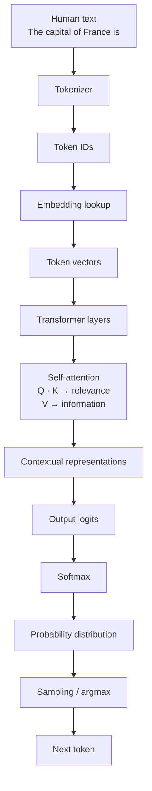

### What you're seeing

This is the **inference pipeline** of a language model.

The key idea is:

> Raw text is converted into token IDs, represented as vectors, processed by the Transformer, converted into logits, turned into probabilities, and finally used to choose the next token.

The model does **not** directly predict words from raw text.

---

## 56.2 What Self-Attention Is Doing

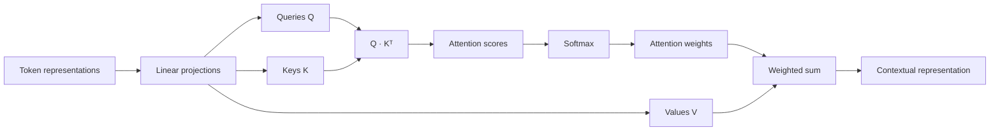

### What you're seeing

For each token:

1. **Q** asks what information it needs.
2. **K** describes what information each token contains.
3. `Q · K` measures relevance.
4. Softmax converts relevance scores into weights.
5. Those weights determine how much information to retrieve from **V**.
6. The weighted values create a new contextual representation.

Remember:

> **Q/K decide relevance. V carries the information being aggregated.**

And:

> Attention scores are not output logits.

---

## 56.3 Training a Language Model

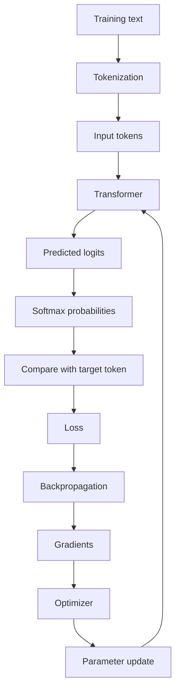

### What you're seeing

This is the fundamental **learning loop**.

The model predicts.

Then we ask:

> How wrong was the prediction?

That produces the loss.

Backpropagation calculates how the loss changes with respect to the parameters.

The optimizer uses those gradients to update the parameters.

Then the model tries again.

The critical distinction:

```text
Backpropagation → calculates gradients
Optimizer       → uses gradients to update parameters
```

---

## 56.4 RL: The Basic Agent Loop

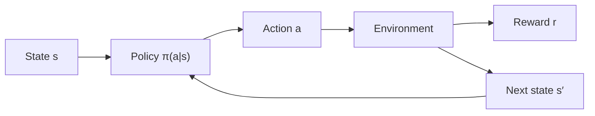

### What you're seeing

This is the basic RL loop.

The agent observes a state, chooses an action, receives feedback, and reaches another state.

The policy is the agent's strategy:

> Given this state, what action should I take?

For an LLM, a possible formulation is:

```text
State  = prompt + context + generated tokens so far
Action = next token
Reward = verifier / task outcome
```

---

## 56.5 V, Q, and Advantage

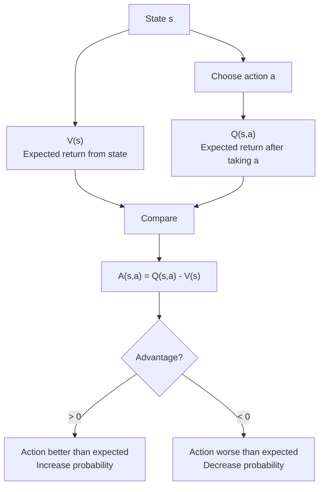

### What you're seeing

The critic/value estimate gives us a **baseline expectation**.

Then we ask:

> Was this particular action better or worse than that expectation?

Example:

```text
V(s) = 8
Q(s,a) = 11

A(s,a) = +3
```

The action performed better than expected.

This is much more informative than merely knowing:

> "The reward was 11."

---

## 56.6 Actor-Critic

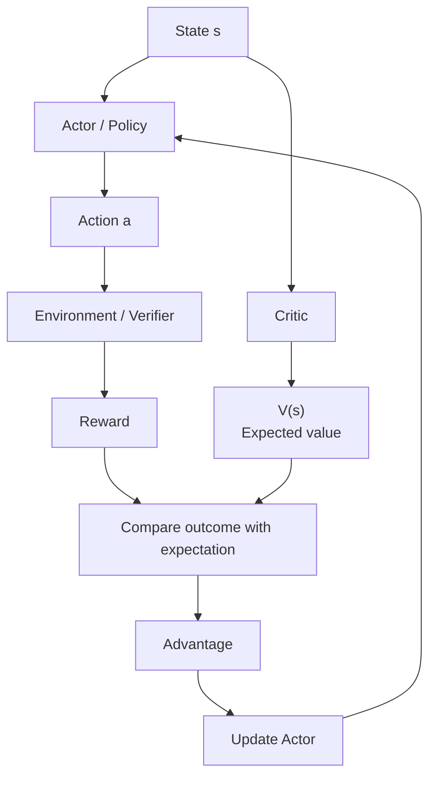

### What you're seeing

There are two learning roles:

**Actor**

> What should I do?

**Critic**

> How good do I expect this state to be?

The environment/verifier is still responsible for producing the actual reward.

The critic helps turn the outcome into a useful relative learning signal.

---

## 56.7 Policy Gradient

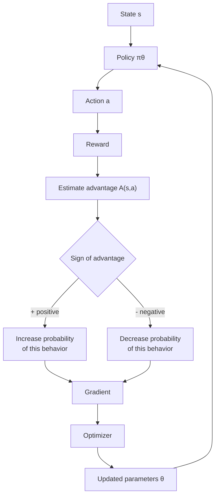

### What you're seeing

Policy gradient turns RL feedback into a parameter update.

The important chain is:

```text
reward
 ↓
advantage
 ↓
gradient
 ↓
parameter update
 ↓
new policy
```

---

## 56.8 PPO

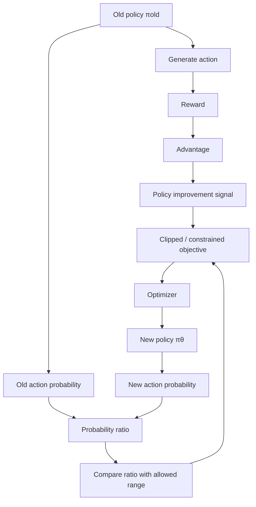

### What you're seeing

PPO asks two questions simultaneously:

1. **Was this behavior good?**
2. **How much did the new policy change its probability?**

It wants:

> Improve good behavior, but don't move the policy too aggressively in one update.

The probability ratio is:

\[
r_t =
\frac{\pi_\theta(a_t|s_t)}
{\pi_{\text{old}}(a_t|s_t)}
\]

---

## 56.9 GRPO for Reasoning Models

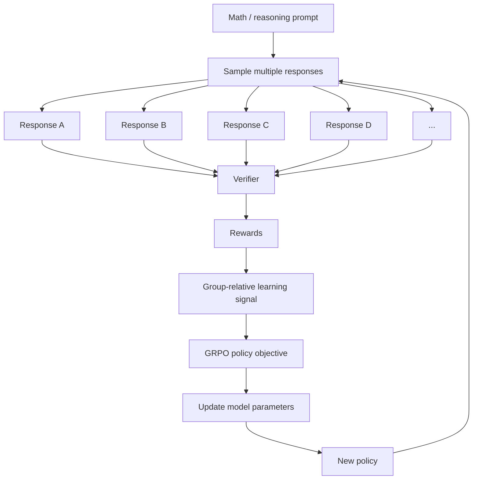

### What you're seeing

GRPO's key idea is:

> Generate multiple responses to the **same prompt**, evaluate them, and use their relative performance to construct the learning signal.

For example:

```text
A → 1
B → 0
C → 1
D → 0
```

The algorithm can identify which responses performed relatively better.

Unlike ordinary test-time search, **GRPO updates the model parameters**.

---

## 56.10 Test-Time Compute / Best-of-N

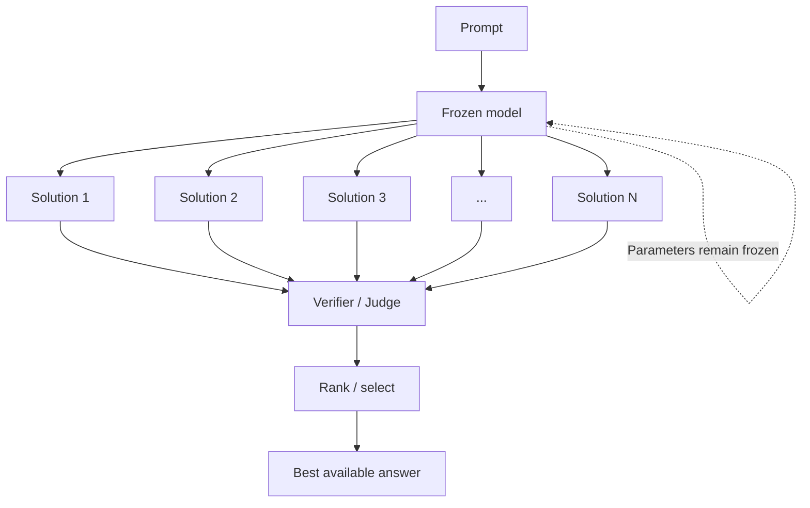

### What you're seeing

This is **test-time compute**, not RL training.

The model spends more computation generating alternatives.

The system can produce a better answer because it searches over more possibilities.

But:

\[
\theta_{after}=\theta_{before}
\]

The underlying model has not learned anything.

---

## 56.11 Test-Time Search vs RL

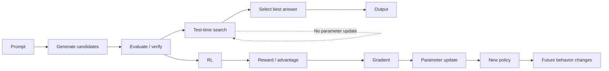

### What you're seeing

This is one of the most important CS329A distinctions.

### Test-time search

```text
Better answer now
```

### RL

```text
Better policy later
```

Search can improve the output without improving the model.

RL changes the model so that future outputs can change.

---

## 56.12 Reward Hacking

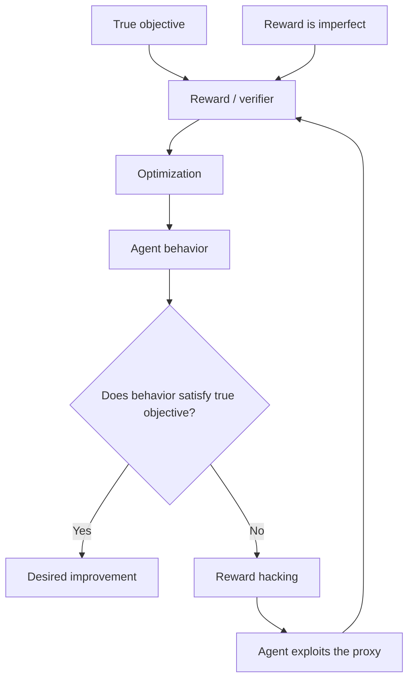

### What you're seeing

The RL system optimizes **the reward you gave it**, not the intention inside your head.

If:

```text
True goal = solve math correctly
Reward = fool verifier
```

then a sufficiently capable optimizer may learn to fool the verifier.

The optimization algorithm can be working perfectly while the overall system gets worse.

---

## 56.13 Credit Assignment in LLM Reasoning

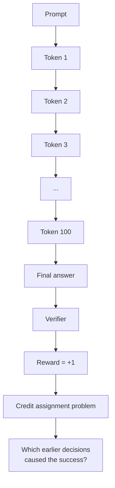

### What you're seeing

The whole trajectory may receive a final reward, but that reward does not automatically tell us how much credit each token/action deserves.

This is why long-horizon reasoning is difficult for RL.

---

## 56.14 The Full Reasoning-RL Loop

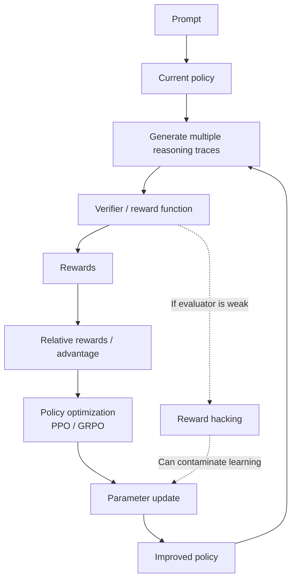

### What you're seeing

This is the complete modern reasoning-RL picture:

```text
generate
 ↓
evaluate
 ↓
compare
 ↓
learn
 ↓
change policy
 ↓
generate again
```

The central bottleneck is often **not the optimizer**.

It is:

> Can we reliably tell which behavior is actually better?

---

## 56.15 Self-Improvement Loop

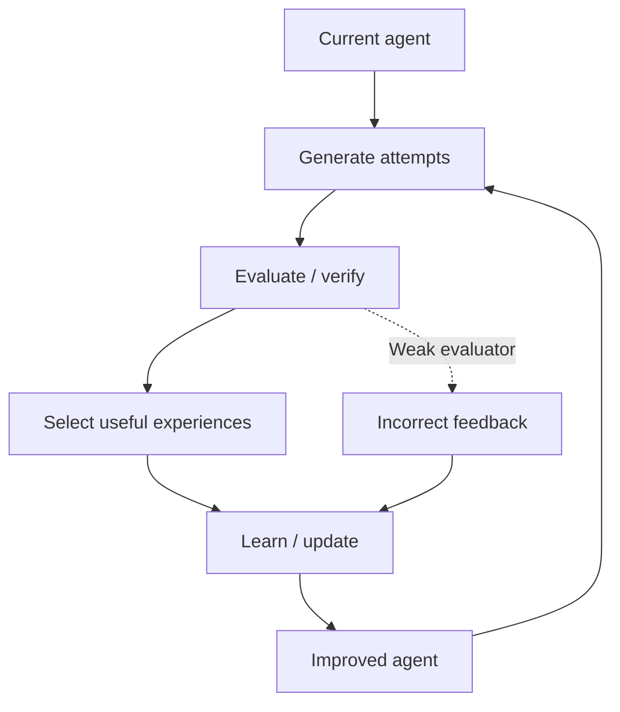

### What you're seeing

This is the broader CS329A idea.

A self-improving agent isn't merely generating an answer.

It creates a loop where its own experiences become inputs to future improvement.

The central research question becomes:

> How can we make sure the improvement loop actually improves the agent rather than amplifying its own mistakes?

---

# 58. The Critical Distinctions

These are the distinctions most worth revising.

  -----------------------------------------------------------------------
  Confusion                           Correct distinction
  ----------------------------------- -----------------------------------
  Token vs parameter                  Token is input/output
                                      representation; parameter is
                                      learned model weight

  Vector vs embedding matrix          Vector = one list; matrix =
                                      collection of vectors

  Attention score vs logit            Attention score is used inside
                                      attention; logits predict output
                                      tokens

  Q/K vs V                            Q/K determine relevance; V is
                                      retrieved/aggregated information

  Loss vs reward                      Loss is optimization
                                      error/objective; reward is
                                      environment feedback

  Backprop vs gradient descent        Backprop computes gradients;
                                      optimizer uses them to update
                                      parameters

  Parameter vs hyperparameter         Parameter is learned;
                                      hyperparameter is configured

  State vs action                     State = current situation; action =
                                      what agent can do

  Q vs V                              Q = value of state + specific
                                      action; V = value of state under
                                      policy

  Reward vs advantage                 Reward is feedback; advantage
                                      measures action outcome relative to
                                      expected state value

  Critic vs reward                    Environment/verifier supplies
                                      reward; critic estimates value

  PPO vs generic policy gradient      PPO constrains policy movement

  PPO vs GRPO                         GRPO uses group-relative signals;
                                      usual GRPO avoids a conventional
                                      critic/value model

  Test-time compute vs RL             Test-time compute keeps parameters
                                      fixed; RL changes parameters

  Search vs learning                  Search improves selected output;
                                      learning changes future policy

  Reward hacking vs model failure     Reward hacking is optimizing the
                                      specified proxy rather than
                                      intended objective

  Sparse reward vs no evaluation      Sparse reward evaluates the
                                      trajectory but gives weak
                                      intermediate credit information
  -----------------------------------------------------------------------

------------------------------------------------------------------------

# 59. One-Pass Mental Model

If you forget everything else, reconstruct the concepts from this:

``` text
                         LLM
                          │
                ┌─────────┴─────────┐
                │                   │
             TRAINING            INFERENCE
                │                   │
          parameters change      parameters fixed
                │                   │
                ↓                   ↓
       prediction → loss      prompt → tokens
                │                   │
          backprop                  │
                │                   │
          gradients                 │
                │                   │
           optimizer                │
                │                   │
                ↓                   ↓
         new parameters       test-time search
                                    │
                              generate many
                                    │
                              verify / rank
                                    │
                                    ↓
                                  answer
```

For RL:

``` text
State
 ↓
Action
 ↓
Reward
 ↓
Value / Q
 ↓
Advantage
 ↓
Policy gradient
 ↓
Parameter update
```

For modern reasoning RL:

``` text
Prompt
 ↓
8/16/etc. candidate solutions
 ↓
Verifier
 ↓
relative rewards
 ↓
GRPO
 ↓
policy update
 ↓
model changes
```

And the central failure mode:

``` text
Bad reward / verifier
        ↓
Wrong behavior gets rewarded
        ↓
RL reinforces it
        ↓
Model becomes better at optimizing the wrong thing
```

------------------------------------------------------------------------

# 60. Quick Self-Test

Before an exam or CS329A lecture, you should be able to answer these
without notes:

1.  What does a tokenizer produce?
2.  What is an embedding?
3.  What are Q, K, and V?
4.  What is the difference between an attention score and a logit?
5.  What does softmax do?
6.  What is a logit?
7.  What does temperature change?
8.  What is loss?
9.  What does backpropagation calculate?
10. What does the optimizer do?
11. What is a parameter vs a hyperparameter?
12. What is an epoch vs a batch?
13. What is a state?
14. What is an action?
15. What is a trajectory?
16. What is return?
17. What is `V(s)`?
18. What is `Q(s,a)`?
19. What is advantage?
20. Why is advantage useful?
21. What does the actor do?
22. What does the critic do?
23. What is policy gradient?
24. What problem does PPO address?
25. What is GRPO?
26. Why generate multiple responses in GRPO?
27. What is reward hacking?
28. What is credit assignment?
29. Why are verifiers useful?
30. Why are verifiers dangerous if imperfect?
31. What is test-time compute?
32. Does test-time search change parameters?
33. What is RL-based self-improvement?
34. What is the difference between improving the answer and improving
    the model?
35. Why is RL for LLMs difficult compared with chess?

If you can answer these precisely, you have the vocabulary needed to
start the deeper CS329A material.

------------------------------------------------------------------------

# 61. Final Cheat Sheet

``` text
TOKEN
↓
tokenizer converts text → token IDs

EMBEDDING
↓
token ID → vector

TRANSFORMER
↓
contextual processing

ATTENTION
↓
Q/K → relevance
V → information retrieved

LOGITS
↓
raw output scores

SOFTMAX
↓
scores → probabilities

TEMPERATURE
↓
changes sampling sharpness

LOSS
↓
how wrong the prediction is

BACKPROP
↓
compute gradients

OPTIMIZER
↓
update parameters

RL
↓
state → action → reward

V(s)
↓
expected return from state

Q(s,a)
↓
expected return for action in state

ADVANTAGE
↓
Q - V
↓
better/worse than expected

ACTOR
↓
chooses actions

CRITIC
↓
estimates value

POLICY GRADIENT
↓
use advantage to change action probabilities

PPO
↓
improve policy without huge updates

GRPO
↓
sample group → compare relative rewards → update policy

VERIFIER
↓
scores behavior

REWARD HACKING
↓
optimize proxy instead of intended goal

CREDIT ASSIGNMENT
↓
which actions caused the final reward?

TEST-TIME COMPUTE
↓
more inference computation, frozen parameters

RL SELF-IMPROVEMENT
↓
feedback → parameter updates → changed future behavior
```
